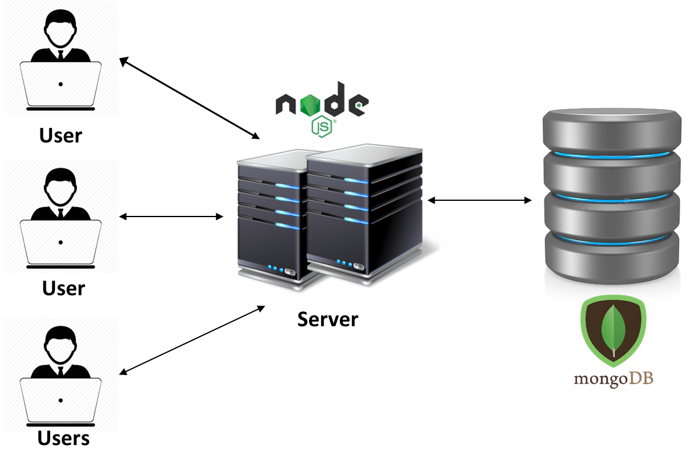
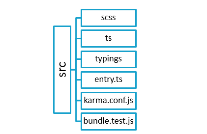

##	About ChatElite

**ChatElite** is a web application that provides peer-to-peer and group chat. ChatElite is developed using Node.js and Mongo DB for database. ChatElite can be used as pluggable chat tool by using collapsed mode. This mode can be used to integrate ChatElite with another web-based application.

ChatElite lets users send messages and files to one another. Besides, users can create groups and also add and remove users from their list. Some of the important features of ChatElite are as follows:

*	**Transfer chat**: Users can transfer the entire one-on-one or group chat/conversation to another person or via email.
*	**Convert chat into group for peer-to-peer chats and for group chat**
*	**Add users to group**: Once a group is formed, user can add new users to the group.
*	**Remove users from group**: From a group, user can remove certain users.
*	**Leave group**: If user is added to certain ChatElite group and doesn’t wish to be a part of it anymore, he can leave the group. 
*	**Search for a keyword in chat**: User can search for a keyword within a chat.
*	**Download chat**: User can download the chat and keep a copy on the PC.
*	**Marking a message as favourite** (or as **un-favourite if marked as favourite previously**)
*	**Deleting messages**
*	**Replying to messages**
*	**Read receipts**: Users can view who has read their messages.

**A user-friendly chat application**:

One of the most important features that ChatElite holds, is its easy use. Here are some more features that make the ChatElite app user-friendly:

*	Users can find the recent chats they were involved in, groups that they were part of and the users added to their list. 
*	Users can view particular chat on clicking on any of the groups or recent chats. 
*	For a peer-to-peer chat, a user can find the groups that one has in common with the particular user and the favourite messages in that chat. 
*	For a group, a user can see all the group members’ information and remove any member if the group has been created by the user himself. 
*	One can also view the shared links in the group chat and the favourite messages in that group chat. 


## Prerequisites

*	**Git**
    * **On Windows**:
        * Download the latest [Git for Windows installer](https://gitforwindows.org/).
        * When you have successfully started the installer, you will see the Git Setup Wizard screen. Follow the Next and Finish prompts to complete the installation.
        *	Open a Command Prompt (or Git Bash if during installation you elected not to use Git from the Windows Command Prompt).
        *	Run the following commands to configure your Git username and email using the following commands. 
```
$ git config --global user.name “user name”
$ git config --global user.email “email id”
```


*	**On Linux/Mac**: To install on a Linux or a Mac, follow [these](https://git-scm.com/book/en/v2/Getting-Started-Installing-Git) instructions.

    *	**Node**: Follow [these](https://nodejs.org/en/download/) instructions to download and install Node.js according to your operating system.

    *	**Mongo**: Follow [these](https://docs.mongodb.com/manual/installation/#mongodb-community-edition) instructions to download and install Mongo DB according to your operating system and requirement.

    *	**Visual Studio Code**: It is recommended. However, you can use any other editor. Follow [these](https://code.visualstudio.com/download) instructions to install Visual Studio Code.


* Dependency on **node-sass**
    *  **node-sass** dependency specifically requires **node-gyp** build tool requires **Python 2.7** and **VCBuild.exe** for Windows.
    Follow the [instructions](https://github.com/sass/node-sass#install) to install clean build of node-sass.


##	System Design

### Architecture


### Web-UI repository structure



This repository contains the code for UI which includes HTML and view-related files. The web-UI repository has src folder which contains all components in the ts typescript format.
 
The **SCSS folder** contains the general and theme-related stylesheet files which after compilation are converted to CSS files. The external CSS files are also imported. 

The **TS folder** contains typescript files for web-UI components which after compilation are converted to js files. It consists of globally declared variables, HTML codes, controller, components, services, interfaces, enums, configuration files, constants, decorators, external files.

The **Typings folder** contains package typings. 

**entry.ts**: All files from different packages are imported here.
**bundle.test.js**: It includes test cases.
**Karma.conf.js**: It includes configuration settings for karma. 

Different loaders are used by webpack to compile the code. The compiler will create bundled JavaScript file.

Start the UI application using NPM start.

###	Repositories

1.	**T-web API**: This repository contains the wrapper methods and framework code which includes socket related methods, server connection and express connection. User has to create instances of classes mentioned in T-web API.
2.	**ChatEliteService**: This repository contains the server-side code which includes business logic, database queries, Socket APIs, REST APIs and API call execution methods.The documentation for this repository is available [here](https://xoriantopensource.github.io/ChatEliteService/).
3.	**ChatEliteUi**: This repository contains the code for UI which includes HTML and view-related files.The documentation for this repository is available [here](https://xoriantopensource.github.io/ChatEliteUi/).

* Before execution on localhost install - 
  * **typescript** using following command : **typescript** is used to compile the code to javascript
    * ```npm install -g typescript```

 * **forever** using following command : **forever** is used to daemonize the process
    * ```npm install forever -g```

###	Execution on localhost

*	Download and unzip **T-web API Repository**
    *	https://chatelite.xoriant.com/t-webapi.zip

*	Go to **T-web API Repository**
    *	```npm install```  
        (Prefer installing node modules with administrator privileges from terminal.)
    *	```npm link```

*	Start **Mongo server**
    
    * Go to the folder where your Mongo binaries are installed.
        * Your_MongoDB_Folder/bin/mongod.exe
        * For [Windows](https://docs.mongodb.com/manual/tutorial/install-mongodb-on-windows/#start-your-mongodb-database)
        * For [Linux Ubuntu](https://docs.mongodb.com/manual/tutorial/install-mongodb-on-ubuntu/#start-mongodb)
        * For [Linux Red Hat](https://docs.mongodb.com/manual/tutorial/install-mongodb-on-red-hat/#start-mongodb)
        * For [Mac OS](https://docs.mongodb.com/manual/tutorial/install-mongodb-on-os-x/#id6)

*	Go to [**Service repository**](https://github.com/XoriantOpenSource/ChatEliteService)
    *	```npm install```
        (Prefer installing node modules with administrator privileges from terminal.)
    *   Compile using command ```tsc```;if you are using VSCode you may compile using short cut command Ctrl+Shift+b 
    *	Run the service using command ```node app.js``` or run in debug mode (for development) using VSCode debug command

*	Go to [**Web-UI repository**](https://github.com/XoriantOpenSource/ChatEliteUi)
    *	```npm install```
         (Prefer installing node modules with administrator privileges from terminal.)
    *	```npm start```

*	Go to browser, in the address bar enter https://localhost:1234
This is needed to trust the certificate as ChatElite uses self-signing certificate.

*	For client interface, go to browser, in the address bar enter https://localhost:8080

*	First register user and then login with that credentials. 

##	Contribution Guidelines

See the contributing guidelines [here](./CONTRIBUTING.md).

## Licensing

Licensed under the [MIT License](./LICENSE).

## Contributors

Thanks goes to these wonderful folks for contribution :

<!-- ALL-CONTRIBUTORS-LIST:START - Do not remove or modify this section -->
<!-- prettier-ignore -->
| [<br /><sub><b>Pranay Dutta</b></sub>](https://github.com/pranaydutta89)<br /> [💻](#code-pranaydutta "Code")  [🤔](#ideas-pranaydutta "Ideas, Planning, & Feedback") | [<br /><sub><b>Abhijeet sonaje</b></sub>](https://github.com/abhijeet2015)<br />[💻](#code-abhijeetsonaje "Code")  [🤔](#ideas-abhijeetsonaje "Ideas, Planning, & Feedback") | [<br /><sub><b>Nayan Kamble</b></sub>](https://github.com/nayankamble)<br />[💻](#code-nayankamble "Code") [📖](#docs-nayankamble "Documentation") | [<br /><sub><b>Ravichandra Bhanage</b></sub>](https://github.com/bhanage-ravic)<br />[💻](#code-ravichandrabhanage "Code") | [<br /><sub><b>Prashant Ipte</b></sub>](https://www.linkedin.com/in/prashant-ipte-003b9634/)<br />[🎨](#design-prashantipte "Design") | [<br /><sub><b>Shailesh Pardeshi</b></sub>](https://github.com/shailesh757)<br />[🤔](#ideas-shaileshpardeshi "Ideas, Planning, & Feedback") |
| :---: | :---: | :---: | :---: | :---: | :---: |
<!-- ALL-CONTRIBUTORS-LIST:END -->